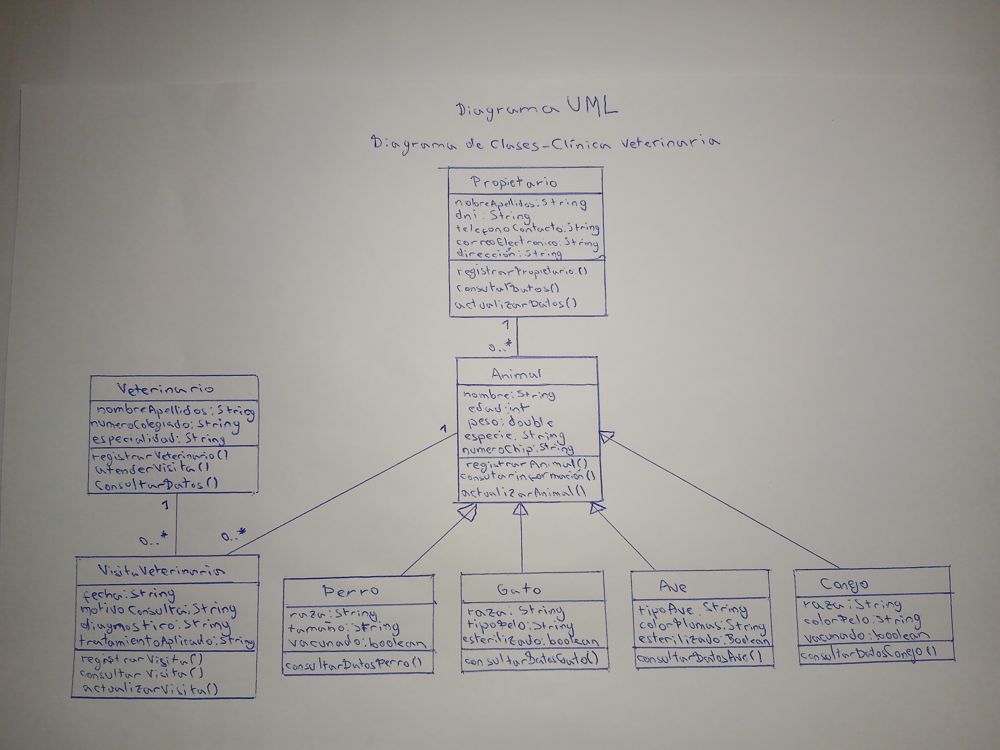
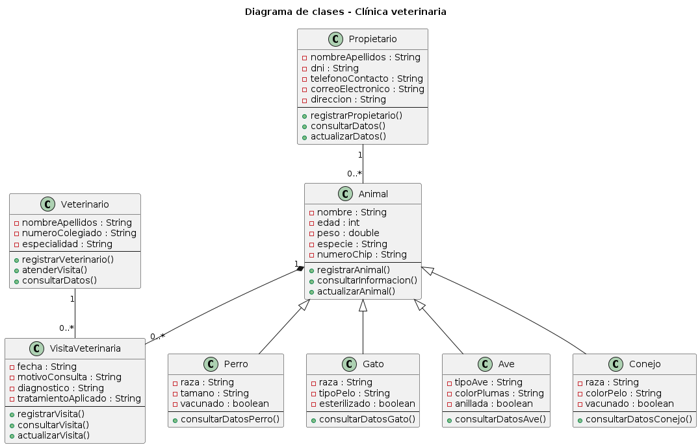

# Práctica UML Recuperación - Clínica Veterinaria

## Descripción

Este proyecto es una práctica de Entornos de Desarrollo.

El trabajo trata sobre una aplicación para una clínica veterinaria.

La aplicación sirve para gestionar los animales, sus propietarios, las visitas veterinarias y los veterinarios.

## Clases principales

Las clases principales del diagrama son:

- Animal
- Perro
- Gato
- Ave
- Conejo
- Propietario
- VisitaVeterinaria
- Veterinario

## Explicación básica

La clase Animal guarda los datos comunes de todos los animales.

Los datos comunes son:

- nombre
- edad
- peso
- especie
- número de chip

Las clases Perro, Gato, Ave y Conejo heredan de Animal.

La clase Propietario guarda los datos del dueño del animal.

La clase VisitaVeterinaria guarda la información de cada visita.

La clase Veterinario guarda los datos del veterinario que atiende la visita.

## Relaciones UML

Un propietario puede tener varios animales.

Un animal puede tener muchas visitas veterinarias.

Un veterinario puede atender muchas visitas.

## Multiplicidades

- Propietario 1 ---- 0..* Animal
- Animal 1 ---- 0..* VisitaVeterinaria
- Veterinario 1 ---- 0..* VisitaVeterinaria

## Herencia

Animal es la clase padre.

Perro, Gato, Ave y Conejo son clases hijas.

## Archivos del repositorio

En el repositorio están los archivos de la práctica:

- diagrama_clinica_veterinaria.puml
- Diagrama_UML_Clinica_Veterinaria.png
- Foto_Diagrama_UML_Mano.jpg
- Practica_UML_Clinica_Veterinaria.docx
- README.md

## Imagen del diagrama UML hecho a mano

## Imagen del diagrama

## Alumno

Michele Massimo Drusco Díaz
